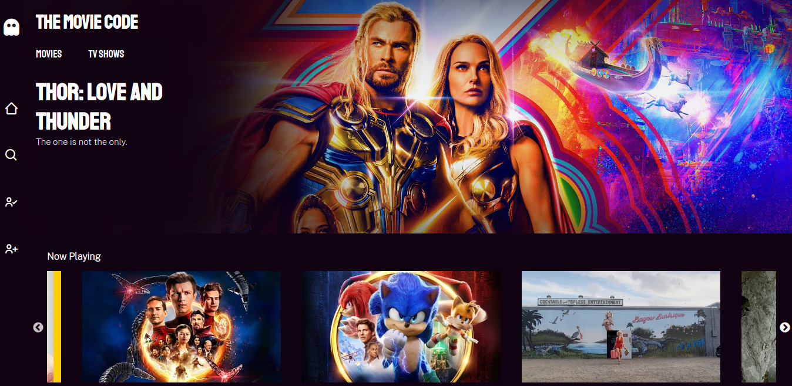

# The Movie Code

### Objetivos

En este proyecto de una semana cree una aplicación que muestre películas y programas de televisión. Consumiendo la información de la API de [_The Movie Database_ (TMDB)](https://www.themoviedb.org/).

### Tecnologías y Herramientas

#### Front
- Javascript 
- React
- Redux
- CSS

#### Back
- Node.js
- Express.js
- Sequelize
- PostgreSQL
- JWT

### Funcionalidades

- Buscar y listar películas.
- Ver los detalles de una película o programa de televisión.
- Crear usuarios.
- _Loguear_ y _desloguear_ usuarios.
- Diferenciar las rutas de _front-end_ para películas y programas de televisión.
- Agregar una película o programa a una lista de favoritos.
- Ver una lista de favoritos.
- Remover una película o programa de una lista de favoritos.
 - Ver a otros usuarios registrados.
- Ver el las películas o programas favoritos de un usuario específico
- Mantener sesión abierta ante un cierre del _browser_ o _refresh_.

### En Desarrollo

- _Full responsive_.
- _Loguear_ usuarios a través de su cuenta en Google.